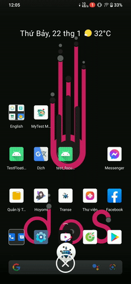

# Floating-Bubble-View-Library-Android

[](https://www.android.com)
[](https://android-arsenal.com/api?level=21)


# Demo

<!--  -->


https://user-images.githubusercontent.com/85553681/151544981-1e080474-77a5-48e7-922d-b01de19cf89a.mp4


<br/>

# I, Prepare

- ### <b> STEP 1. Add the JitPack repository to your build.gradle (Project) file </b>

Add it in your root build.gradle at the end of repositories:

```gradle
    // not buildScript
    allprojects {
        repositories {
            ...
            maven { url 'https://jitpack.io' }
        }
    }

```

## If anything go WRONG, forget the step above. Go to your setting.gradle file

then add maven repository inside "dependencyResolutionManagement => repositories" like below

```gradle
    dependencyResolutionManagement {
        repositoriesMode.set(RepositoriesMode.FAIL_ON_PROJECT_REPOS)
        repositories {
            google()
            mavenCentral()

            // add here
            maven { url 'https://jitpack.io' }

            jcenter() // Warning: this repository is going to shut down soon
        }
    }
```

<br/>

- ### <b> STEP 2. Add dependency in your app module </b>

```gradle
    dependencies {
            implementation 'com.github.TorryDo:Floating-Bubble-View:0.2.1'
    }

```

# II, How to use

- ### <b> Step 1 : create a subclass of FloatingBubbleService </b>

```java
    public class MyService extends FloatingBubbleService {
        ...
    }
```

</br>

- ### <b> Step 2 : override 2 methods "setupBubble" and "setupExpandableView" </b>

```java
    public class MyService extends FloatingBubbleService {

        @NonNull
        @Override
        public FloatingBubble.Builder setupBubble() {
            return ...;
        }

        @NonNull
        @Override
        public ExpandableView.Builder setupExpandableView(@NonNull ExpandableView.Action action) {
            return ...;
        }
    }
```

</br>

- ### <b> Step 3 : add your service class in manifest file... </b>

```xml
    <service android:name="<YOUR_PACKAGE>.MyService" />
```

</br>

- ### <b> Step 4 : start your service and enjoy :) </b>

```java
    Intent intent = new Intent(MainActivity.this, MyService.class);
    startService(intent);
```

# Sample class

```java
public class MyService extends FloatingBubbleService {

    @NonNull
    @Override
    public FloatingBubble.Builder setupBubble(@NonNull FloatingBubble.Action action) {

        return new FloatingBubble.Builder()
                .with(this)
                .setIcon(R.drawable.ic_rounded_blue_diamond)
                .setRemoveIcon(R.drawable.ic_remove_icon)
                .addFloatingBubbleTouchListener(new FloatingBubble.TouchEvent() {
                    @Override
                    public void onDestroy() {
                        System.out.println("on Destroy");
                    }

                    @Override
                    public void onClick() {
                        action.navigateToExpandableView();
                    }

                    @Override
                    public void onMove(int x, int y) {
                        System.out.println("onMove");
                    }

                    @Override
                    public void onUp(int x, int y) {
                        System.out.println("onUp");
                    }

                    @Override
                    public void onDown(int x, int y) {
                        System.out.println("onDown");
                    }
                })
                .setBubbleSizeDp(60)
                .setStartPoint(-200, 0)
                .setAlpha(1f);
    }

    @Nullable
    @Override
    public ExpandableView.Builder setupExpandableView(@NonNull ExpandableView.Action action) {
        LayoutInflater inflater = (LayoutInflater) getSystemService(LAYOUT_INFLATER_SERVICE);
        View layout = inflater.inflate(R.layout.layout_view_test, null);


        layout.findViewById(R.id.card_view).setOnClickListener(v -> {
            Toast.makeText(this, "hello from card view from java", Toast.LENGTH_SHORT).show();
            action.popToBubble();
        });


        return new ExpandableView.Builder()
                .with(this)
                .setExpandableView(layout)
                .setDimAmount(0.8f);
    }
}
```
## License
```


    Copyright 2022 

    Licensed under the Apache License, Version 2.0 (the "License");
    you may not use this file except in compliance with the License.
    You may obtain a copy of the License at

       http://www.apache.org/licenses/LICENSE-2.0

    Unless required by applicable law or agreed to in writing, software
    distributed under the License is distributed on an "AS IS" BASIS,
    WITHOUT WARRANTIES OR CONDITIONS OF ANY KIND, either express or implied.
    See the License for the specific language governing permissions and
    limitations under the License.

```
